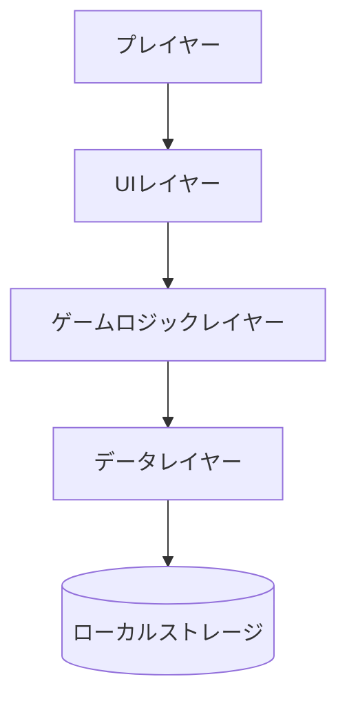
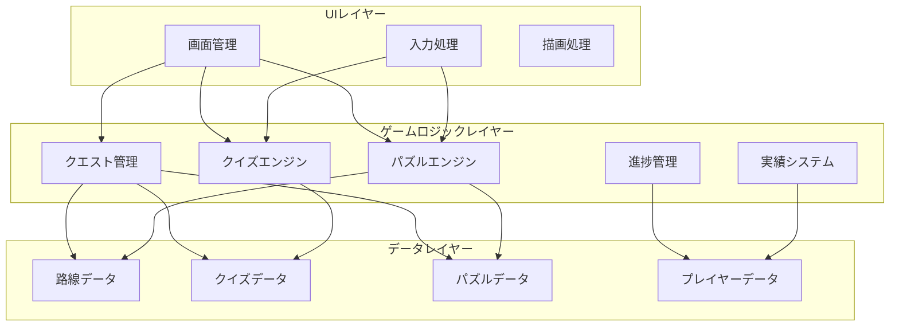
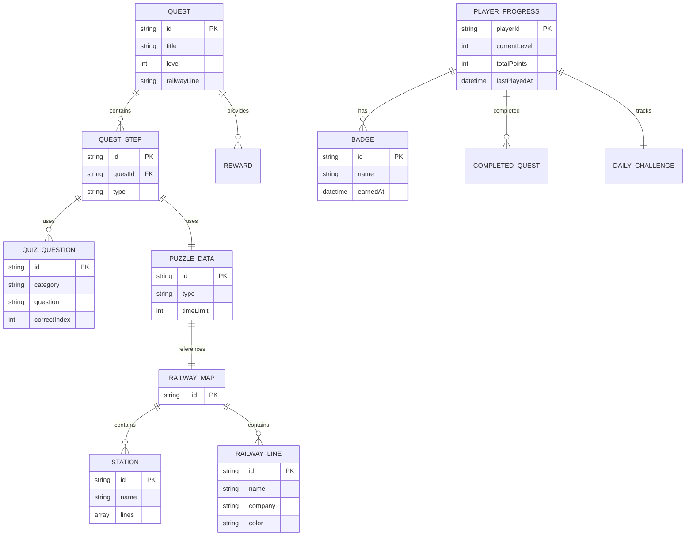
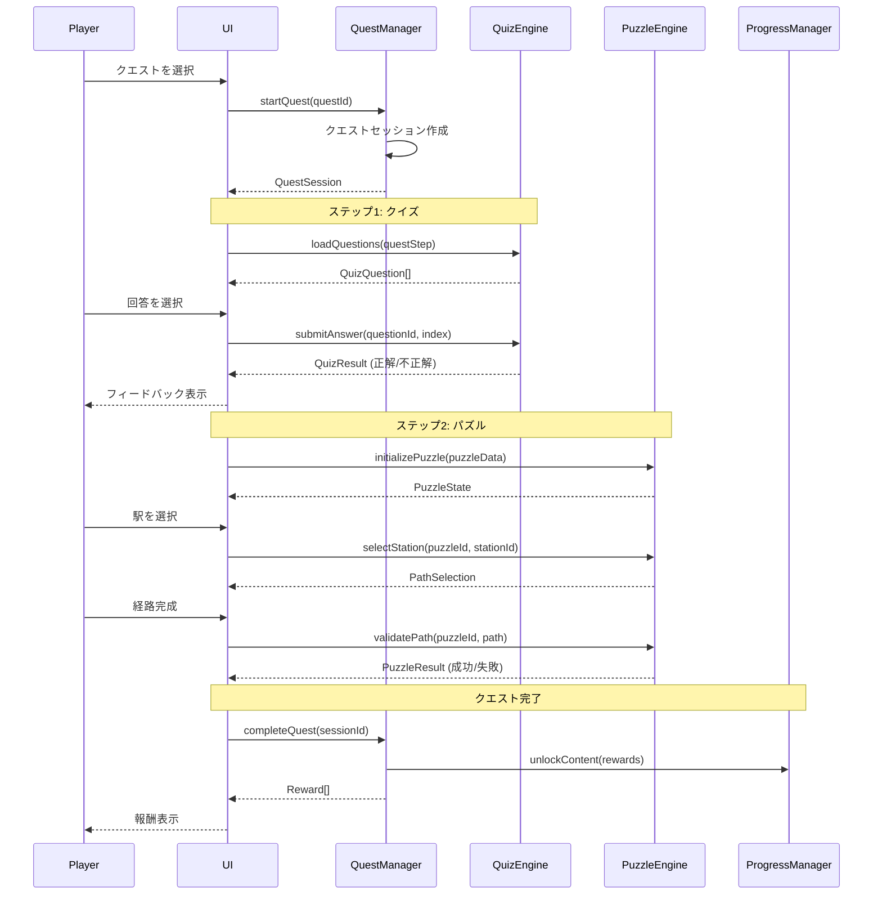
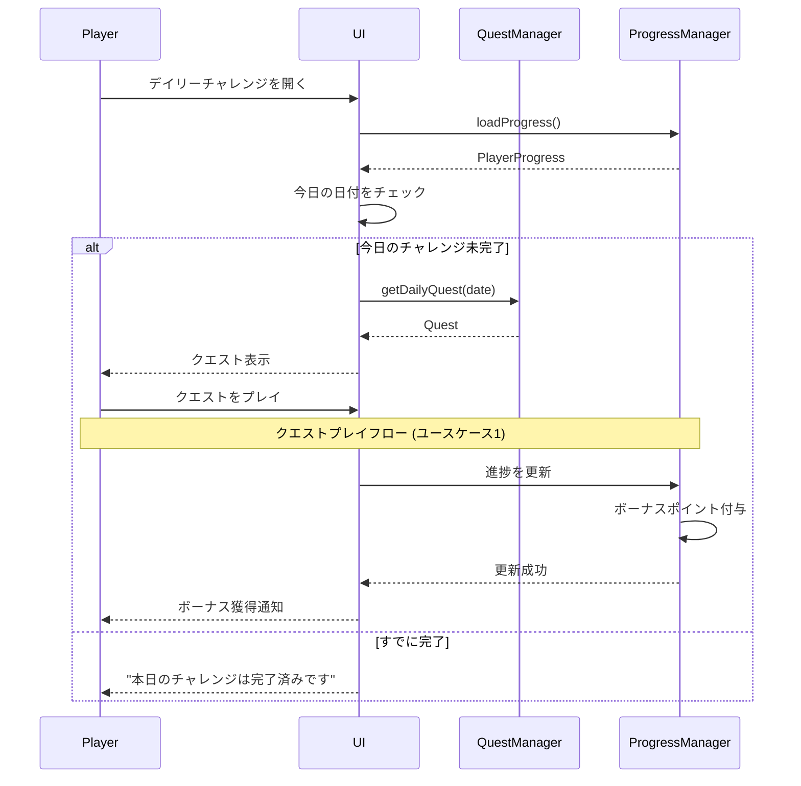
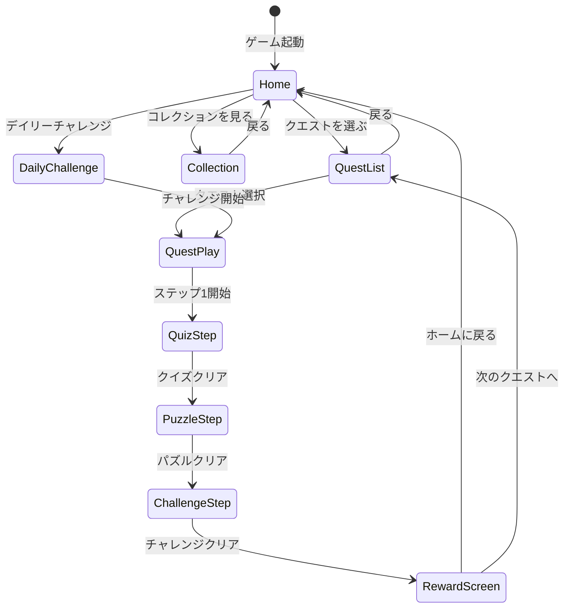

# 機能設計書 (Functional Design Document)

## システム構成図



### レイヤー構成の詳細



## 技術スタック

| 分類 | 技術 | 選定理由 |
|------|------|----------|
| 言語 | TypeScript | 型安全性、開発効率、メンテナンス性 |
| UIフレームワーク | React | コンポーネント設計、豊富なエコシステム |
| 状態管理 | Zustand | シンプルで軽量、学習コストが低い |
| スタイリング | Tailwind CSS | レスポンシブデザイン、開発速度 |
| データ保存 | localStorage API | ブラウザネイティブ、ユーザー登録不要 |
| ビルドツール | Vite | 高速なHMR、最新のビルド設定 |
| テストフレームワーク | Vitest + React Testing Library | Viteとの統合、コンポーネントテスト |

## データモデル定義

### エンティティ: Quest(クエスト)

```typescript
interface Quest {
  id: string;                      // クエストID (例: "quest-yamanote-01")
  title: string;                   // クエストタイトル (例: "山手線マスターへの道")
  description: string;             // クエスト説明
  level: DifficultyLevel;          // 難易度レベル (1-4)
  railwayLine: string;             // 対象路線ID
  steps: QuestStep[];              // クエストステップ (クイズ→パズル→チャレンジ)
  rewards: Reward[];               // クリア報酬
  unlockCondition?: UnlockCondition; // アンロック条件
}

type DifficultyLevel = 1 | 2 | 3 | 4; // 1: ビギナー、2: 中級者、3: 上級者、4: マニア

interface QuestStep {
  type: 'quiz' | 'puzzle' | 'challenge';
  content: QuizQuestion[] | PuzzleData | ChallengeData;
}

interface Reward {
  type: 'railway_line' | 'vehicle_card' | 'badge' | 'points';
  id: string;                      // 報酬ID
  name: string;                    // 報酬名
  rarity?: 'common' | 'rare' | 'legendary'; // レア度
}

interface UnlockCondition {
  requiredQuestIds?: string[];     // 前提クエストID
  requiredLevel?: DifficultyLevel; // 必要レベル
}
```

### エンティティ: QuizQuestion(クイズ問題)

```typescript
interface QuizQuestion {
  id: string;                      // 問題ID
  category: QuizCategory;          // カテゴリ
  question: string;                // 問題文
  choices: string[];               // 選択肢 (4つ)
  correctIndex: number;            // 正解のインデックス (0-3)
  explanation: string;             // 解説・豆知識
  difficulty: DifficultyLevel;     // 難易度
}

type QuizCategory = 
  | 'station_name'      // 駅名
  | 'line_name'         // 路線名
  | 'travel_time'       // 所要時間
  | 'transfer'          // 乗り換え
  | 'company_features'  // 会社の特色
  | 'direct_operation'; // 相互直通運転
```

### エンティティ: PuzzleData(パズルデータ)

```typescript
interface PuzzleData {
  id: string;                      // パズルID
  type: PuzzleType;                // パズル種類
  title: string;                   // パズルタイトル
  description: string;             // 説明
  railwayMap: RailwayMap;          // 路線図データ
  startStation: string;            // 出発駅ID
  goalStation: string;             // 目的駅ID
  constraints: PuzzleConstraint[]; // 制約条件
  timeLimit: number;               // 制限時間 (秒)
  correctPath: string[];           // 正解経路 (駅IDの配列)
}

type PuzzleType = 
  | 'route_selection'   // 経路選択
  | 'transfer_puzzle'   // 乗り換えパズル
  | 'direct_operation'  // 相互直通
  | 'time_table'        // 時刻表
  | 'optimization';     // 最適化

interface PuzzleConstraint {
  type: 'max_stations' | 'max_transfers' | 'specific_line';
  value: number | string;
}
```

### エンティティ: RailwayMap(路線図)

```typescript
interface RailwayMap {
  stations: Station[];             // 駅のリスト
  lines: RailwayLine[];            // 路線のリスト
  connections: Connection[];       // 接続情報
}

interface Station {
  id: string;                      // 駅ID (例: "st-shibuya")
  name: string;                    // 駅名 (例: "渋谷")
  lines: string[];                 // 停車する路線ID
  position: { x: number; y: number }; // 路線図上の座標
}

interface RailwayLine {
  id: string;                      // 路線ID (例: "line-yamanote")
  name: string;                    // 路線名 (例: "山手線")
  company: string;                 // 運営会社 (例: "JR東日本")
  color: string;                   // 路線カラー (例: "#9ACD32")
  category: 'jr' | 'private' | 'metro'; // 分類
  stations: string[];              // 駅IDの順序付きリスト
}

interface Connection {
  fromStationId: string;
  toStationId: string;
  lineId: string;
  travelTime: number;              // 所要時間 (分)
}
```

### エンティティ: PlayerProgress(プレイヤー進捗)

```typescript
interface PlayerProgress {
  playerId: string;                // プレイヤーID (UUID)
  currentLevel: DifficultyLevel;   // 現在のレベル
  completedQuestIds: string[];     // クリア済みクエストID
  unlockedLineIds: string[];       // アンロック済み路線ID
  unlockedVehicleIds: string[];    // アンロック済み車両ID
  badges: Badge[];                 // 獲得バッジ
  totalPoints: number;             // 累計ポイント
  dailyChallenge: DailyChallengeProgress; // デイリーチャレンジ進捗
  statistics: PlayerStatistics;    // 統計情報
  createdAt: Date;                 // 作成日時
  lastPlayedAt: Date;              // 最終プレイ日時
}

interface Badge {
  id: string;
  name: string;
  description: string;
  earnedAt: Date;
}

interface DailyChallengeProgress {
  date: string;                    // 日付 (YYYY-MM-DD)
  questId: string;                 // 今日のクエストID
  completed: boolean;              // 完了フラグ
  bonusPoints: number;             // ボーナスポイント
}

interface PlayerStatistics {
  totalQuizzes: number;            // 総クイズ回答数
  correctQuizzes: number;          // 正解数
  totalPuzzles: number;            // 総パズル挑戦数
  completedPuzzles: number;        // クリア数
  averagePlayTime: number;         // 平均プレイ時間 (分)
  consecutiveDays: number;         // 連続プレイ日数
}
```

### ER図



## コンポーネント設計

### UIレイヤー

#### Screen: 画面管理

**責務**:
- 画面遷移の管理
- 画面表示の制御

**インターフェース**:
```typescript
class ScreenManager {
  navigate(screen: ScreenType): void;
  getCurrentScreen(): ScreenType;
}

type ScreenType = 
  | 'home'           // ホーム画面
  | 'quest_list'     // クエスト一覧
  | 'quest_play'     // クエストプレイ中
  | 'collection'     // コレクション
  | 'daily_challenge'; // デイリーチャレンジ
```

#### RailwayLinePhoto: 路線写真コンポーネント

**責務**:
- 路線写真の表示
- 帰属表示(アトリビューション)の常時表示

**インターフェース**:
```typescript
interface RailwayLinePhotoProps {
  photo: RailwayPhoto;
}
```

**表示仕様**:
- 写真の下部に帰属表示を常時表示する
- 表示例: `📷 撮影者名 / Wikimedia Commons / CC BY-SA 4.0`
- 帰属テキストは写真の外側(下)に小さなグレーテキストで表示する
- CC0ライセンスでも一貫性のため帰属表示を行う

#### Quiz/PuzzleUI: ゲーム画面UI

**責務**:
- クイズ/パズルの表示
- ユーザー入力の受付
- フィードバック表示

### ゲームロジックレイヤー

#### QuestManager: クエスト管理

**責務**:
- クエストの読み込み
- クエスト進行の管理
- クリア判定と報酬付与

**インターフェース**:
```typescript
class QuestManager {
  loadQuest(questId: string): Quest;
  startQuest(questId: string): QuestSession;
  completeStep(sessionId: string, result: StepResult): void;
  completeQuest(sessionId: string): Reward[];
  getAvailableQuests(level: DifficultyLevel): Quest[];
}

interface QuestSession {
  sessionId: string;
  questId: string;
  currentStepIndex: number;
  startedAt: Date;
  results: StepResult[];
}

interface StepResult {
  stepIndex: number;
  success: boolean;
  score: number;
  completedAt: Date;
}
```

#### QuizEngine: クイズエンジン

**責務**:
- クイズ問題の出題
- 回答の採点
- 解説の表示

**インターフェース**:
```typescript
class QuizEngine {
  loadQuestions(questStep: QuestStep): QuizQuestion[];
  submitAnswer(questionId: string, selectedIndex: number): QuizResult;
}

interface QuizResult {
  correct: boolean;
  correctIndex: number;
  explanation: string;
}
```

#### PuzzleEngine: パズルエンジン

**責務**:
- パズルの初期化
- 経路選択の検証
- 制約条件のチェック

**インターフェース**:
```typescript
class PuzzleEngine {
  initializePuzzle(puzzleData: PuzzleData): PuzzleState;
  selectStation(puzzleId: string, stationId: string): PathSelection;
  validatePath(puzzleId: string, selectedPath: string[]): PuzzleResult;
}

interface PuzzleState {
  puzzleId: string;
  selectedPath: string[];
  remainingTime: number;
  status: 'in_progress' | 'completed' | 'failed';
}

interface PathSelection {
  valid: boolean;           // 選択可能な駅か
  currentPath: string[];
  canComplete: boolean;     // ゴールに到達したか
}

interface PuzzleResult {
  success: boolean;
  actualPath: string[];
  correctPath: string[];
  timeTaken: number;
  score: number;
}
```

#### ProgressManager: 進捗管理

**責務**:
- プレイヤー進捗の保存
- アンロック判定
- レベルアップ処理

**インターフェース**:
```typescript
class ProgressManager {
  loadProgress(): PlayerProgress;
  saveProgress(progress: PlayerProgress): void;
  unlockContent(contentType: 'line' | 'vehicle' | 'badge', contentId: string): void;
  checkLevelUp(): boolean;
  earnBadge(badgeId: string): Badge;
}
```

#### BadgeSystem: 実績システム

**責務**:
- バッジ獲得条件の判定
- 実績の記録

**インターフェース**:
```typescript
class BadgeSystem {
  checkBadgeConditions(progress: PlayerProgress): Badge[];
  getBadgeById(badgeId: string): BadgeDefinition;
  getUnlockedBadges(): Badge[];
}

interface BadgeDefinition {
  id: string;
  name: string;
  description: string;
  condition: BadgeCondition;
}

interface BadgeCondition {
  type: 'complete_quest' | 'complete_line' | 'quiz_streak' | 'play_days';
  requirement: any;
}
```

### データレイヤー

**責務**:
- データの永続化、取得、キャッシュ管理

**許可される操作**:
- localStorage、静的データファイルへのアクセス

**禁止される操作**:
- ビジネスロジックの実装

**主要コンポーネント**:
  - RailwayDataRepository: 路線データの提供
  - QuizDataRepository: クイズデータの提供 (RailwayDataRepositoryから路線情報を参照)
  - PuzzleDataRepository: パズルデータの提供 (RailwayDataRepositoryから路線情報を参照)
  - PlayerDataRepository: プレイヤーデータの永続化

**リポジトリ間の依存関係**:
```
QuizDataRepository → RailwayDataRepository
PuzzleDataRepository → RailwayDataRepository
PlayerDataRepository (独立)
```

#### RailwayDataRepository: 路線データリポジトリ

**責務**:
- 路線データの読み込み
- 駅・路線情報の提供

**インターフェース**:
```typescript
class RailwayDataRepository {
  loadRailwayMap(): RailwayMap;
  getStationById(stationId: string): Station;
  getLineById(lineId: string): RailwayLine;
  findPath(fromStationId: string, toStationId: string, constraints?: PathConstraints): Path[];
}

interface PathConstraints {
  maxTransfers?: number;
  allowedLines?: string[];
}

interface Path {
  stations: Station[];
  lines: RailwayLine[];
  totalTime: number;
  transferCount: number;
}
```

#### PlayerDataRepository: プレイヤーデータリポジトリ

**責務**:
- ローカルストレージへの保存/読み込み
- データのバックアップ

**インターフェース**:
```typescript
class PlayerDataRepository {
  save(progress: PlayerProgress): void;
  load(): PlayerProgress | null;
  exists(): boolean;
  reset(): void;
}
```

## ユースケース図

### ユースケース1: クエストプレイ



### ユースケース2: デイリーチャレンジ



## 画面遷移図



## アルゴリズム設計

### パズル経路検証アルゴリズム

**目的**: プレイヤーが選択した経路が正解かどうかを判定する

**検証ロジック**:

#### ステップ1: 経路の連続性チェック

プレイヤーが選択した駅が、実際に路線でつながっているかを確認します。

```typescript
function validatePathContinuity(
  selectedPath: string[],
  railwayMap: RailwayMap
): boolean {
  for (let i = 0; i < selectedPath.length - 1; i++) {
    const currentStation = selectedPath[i];
    const nextStation = selectedPath[i + 1];
    
    const connection = railwayMap.connections.find(
      c => c.fromStationId === currentStation && c.toStationId === nextStation
    );
    
    if (!connection) {
      return false; // 接続がない
    }
  }
  
  return true;
}
```

#### ステップ2: 制約条件のチェック

パズルに設定された制約(最大駅数、最大乗り換え回数など)を満たしているか確認します。

```typescript
function validateConstraints(
  selectedPath: string[],
  constraints: PuzzleConstraint[],
  railwayMap: RailwayMap
): boolean {
  for (const constraint of constraints) {
    switch (constraint.type) {
      case 'max_stations':
        if (selectedPath.length > constraint.value) {
          return false;
        }
        break;
        
      case 'max_transfers':
        const transferCount = countTransfers(selectedPath, railwayMap);
        if (transferCount > constraint.value) {
          return false;
        }
        break;
        
      case 'specific_line':
        if (!pathUsesLine(selectedPath, constraint.value as string, railwayMap)) {
          return false;
        }
        break;
    }
  }
  
  return true;
}

function countTransfers(path: string[], railwayMap: RailwayMap): number {
  let transfers = 0;
  let currentLine: string | null = null;
  
  for (let i = 0; i < path.length - 1; i++) {
    const connection = railwayMap.connections.find(
      c => c.fromStationId === path[i] && c.toStationId === path[i + 1]
    );
    
    if (connection) {
      if (currentLine && currentLine !== connection.lineId) {
        transfers++;
      }
      currentLine = connection.lineId;
    }
  }
  
  return transfers;
}
```

#### ステップ3: スコア計算

制限時間内にクリアしたかどうかと、制約条件の達成度合いでスコアを算出します。

```typescript
function calculatePuzzleScore(
  selectedPath: string[],
  correctPath: string[],
  timeTaken: number,
  timeLimit: number,
  constraints: PuzzleConstraint[]
): number {
  let score = 0;
  
  // 基本スコア: 正解なら50点
  if (arraysEqual(selectedPath, correctPath)) {
    score += 50;
  }
  
  // 時間ボーナス: 早くクリアするほど高得点 (最大30点)
  const timeRatio = 1 - (timeTaken / timeLimit);
  score += Math.floor(timeRatio * 30);
  
  // 効率ボーナス: 最小駅数・乗り換えなら追加点 (最大20点)
  const isOptimal = isOptimalPath(selectedPath, correctPath, constraints);
  if (isOptimal) {
    score += 20;
  }
  
  return Math.min(score, 100); // 最大100点
}
```

**実装例**:
```typescript
class PuzzleEngine {
  validatePath(puzzleId: string, selectedPath: string[]): PuzzleResult {
    const puzzle = this.getPuzzleById(puzzleId);
    const railwayMap = this.railwayDataRepository.loadRailwayMap();
    
    // ステップ1: 連続性チェック
    const isContinuous = this.validatePathContinuity(selectedPath, railwayMap);
    if (!isContinuous) {
      return {
        success: false,
        actualPath: selectedPath,
        correctPath: puzzle.correctPath,
        timeTaken: 0,
        score: 0
      };
    }
    
    // ステップ2: 制約チェック
    const meetsConstraints = this.validateConstraints(
      selectedPath,
      puzzle.constraints,
      railwayMap
    );
    
    // ステップ3: スコア計算
    const timeTaken = Date.now() - this.puzzleStates[puzzleId].startTime;
    const score = this.calculatePuzzleScore(
      selectedPath,
      puzzle.correctPath,
      timeTaken / 1000, // ミリ秒→秒
      puzzle.timeLimit,
      puzzle.constraints
    );
    
    const success = meetsConstraints && 
                    this.pathMatchesGoal(selectedPath, puzzle);
    
    return {
      success,
      actualPath: selectedPath,
      correctPath: puzzle.correctPath,
      timeTaken: timeTaken / 1000,
      score
    };
  }
}
```

### 難易度レベルアンロックアルゴリズム

**目的**: プレイヤーの進捗に応じて次のレベルをアンロックする

**アンロック条件** (暫定値、PRD更新後に調整):
- レベル1→2: レベル1のクエストを3つ以上クリア
- レベル2→3: レベル2のクエストを5つ以上クリア
- レベル3→4: レベル3のクエストを8つ以上クリア

> **注記**: 上記の数値はゲームバランスを考慮した暫定値です。ユーザーテスト後に調整が必要になる可能性があります。PRDへの反映を推奨します

```typescript
function checkLevelUp(progress: PlayerProgress): DifficultyLevel | null {
  const completedByLevel = this.countCompletedQuestsByLevel(progress);
  
  if (progress.currentLevel === 1 && completedByLevel[1] >= 3) {
    return 2;
  }
  
  if (progress.currentLevel === 2 && completedByLevel[2] >= 5) {
    return 3;
  }
  
  if (progress.currentLevel === 3 && completedByLevel[3] >= 8) {
    return 4;
  }
  
  return null; // レベルアップなし
}
```

## UI設計

### クイズ画面

**表示項目**:
- 問題文
- 4つの選択肢(A, B, C, D)
- 残り問題数インジケーター
- 回答後のフィードバック(正解/不正解、解説)

**カラーコーディング**:
- 正解: 緑色(#10B981)
- 不正解: 赤色(#EF4444)
- 未選択: グレー(#6B7280)

### パズル画面

**表示項目**:
- 路線図(SVG形式)
- 駅アイコン(選択可能/不可を色で表現)
- 現在の経路(ハイライト表示)
- 制約条件表示(残り駅数、乗り換え回数など)
- タイマー(残り時間)

**インタラクション**:
1. 出発駅が自動選択された状態でスタート
2. プレイヤーが次の駅をクリック/タップ
3. 選択した駅が経路に追加され、ハイライト表示
4. 目的駅に到達したら「完了」ボタンが有効化
5. 完了ボタンを押すと検証が実行される

### コレクション画面

**表示項目**:
| 項目 | 説明 | フォーマット |
|------|------|-------------|
| 路線カード | アンロック済み路線 | 路線名、路線カラー、会社名 |
| 車両カード | アンロック済み車両 | 車両名、画像、レア度 |
| バッジ | 獲得したバッジ | バッジ名、獲得日時、説明 |

**カラーコーディング**:
- レア度: Common(白)、Rare(青)、Legendary(金)
- アンロック済み: カラー表示
- 未アンロック: グレースケール表示

## ファイル構造

### データ保存形式

```
localStorage
├── railway_game_progress    # プレイヤー進捗データ
└── railway_game_settings    # ゲーム設定
```

**railway_game_progress の内容例**:
```json
{
  "playerId": "7a5c6ff0-5f55-474e-baf7-ea13624d73a4",
  "currentLevel": 2,
  "completedQuestIds": ["quest-yamanote-01", "quest-chuo-01", "quest-tobu-01"],
  "unlockedLineIds": ["line-yamanote", "line-chuo", "line-tobu-kamedo"],
  "unlockedVehicleIds": ["vehicle-e235", "vehicle-e233"],
  "badges": [
    {
      "id": "badge-yamanote-master",
      "name": "山手線マスター",
      "description": "山手線のクエストを全てクリア",
      "earnedAt": "2026-05-01T10:30:00.000Z"
    }
  ],
  "totalPoints": 1250,
  "dailyChallenge": {
    "date": "2026-05-05",
    "questId": "quest-tokyu-daily-01",
    "completed": false,
    "bonusPoints": 100
  },
  "statistics": {
    "totalQuizzes": 45,
    "correctQuizzes": 38,
    "totalPuzzles": 15,
    "completedPuzzles": 12,
    "averagePlayTime": 18,
    "consecutiveDays": 7
  },
  "createdAt": "2026-04-15T08:00:00.000Z",
  "lastPlayedAt": "2026-05-05T09:00:00.000Z"
}
```

## パフォーマンス最適化

### パフォーマンス目標

参照: [アーキテクチャ設計書 - パフォーマンス要件](./architecture.md#パフォーマンス要件)

| 操作 | 目標時間 |
|------|---------|
| 路線データの読み込み | 500ms以内/路線 |
| クイズ回答後のフィードバック表示 | 500ms以内 |
| パズル経路選択のレスポンス | 100ms以内 |
| プレイヤーデータの保存 | 100ms以内 |

### 最適化戦略

- **路線図データの遅延読み込み**: 必要な路線のみロード (目標: 500ms以内)
- **画像の最適化**: WebP形式、レスポンシブ画像 (初回ダウンロード2MB以内)
- **状態管理の最適化**: 不要な再レンダリングを防ぐ
- **ローカルストレージのキャッシュ**: 頻繁なアクセスを避ける (読み込み100ms以内)

## セキュリティ考慮事項

- **XSS対策**: ユーザー入力は使用しないため、基本的にリスクなし
- **データ保護**: ローカルストレージのみ使用、個人情報は保存しない
- **HTTPS**: 本番環境では必ずHTTPSを使用

## エラーハンドリング

### エラーの分類

| エラー種別 | 処理 | ユーザーへの表示 |
|-----------|------|-----------------|
| ローカルストレージ読み込み失敗 | デフォルトデータで初期化 | 「新しいゲームを開始します」 |
| 路線データ読み込み失敗 | リロードを促す | 「データの読み込みに失敗しました。ページを再読み込みしてください」 |
| タイムアウト | パズル失敗として処理 | 「時間切れです。もう一度挑戦してください」 |
| 無効な経路選択 | エラー表示、再選択を促す | 「この経路は選択できません」 |

## テスト戦略

### ユニットテスト
- QuizEngine: 正解/不正解の判定
- PuzzleEngine: 経路検証ロジック
- ProgressManager: 進捗保存/読み込み
- BadgeSystem: バッジ獲得条件の判定

### 統合テスト
- クエストプレイフロー全体
- デイリーチャレンジのリセット
- レベルアップ処理

### E2Eテスト
- クエストを開始してクリアまでの流れ
- コレクション画面での表示確認
- ローカルストレージへの保存確認
