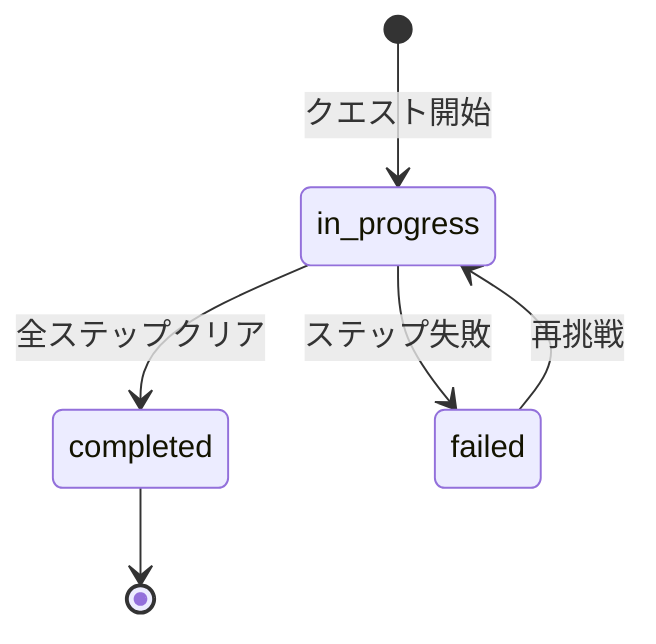
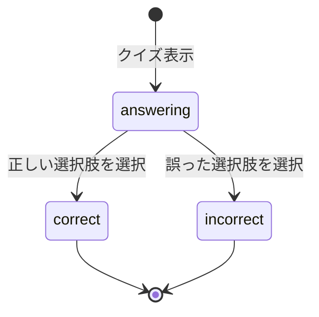
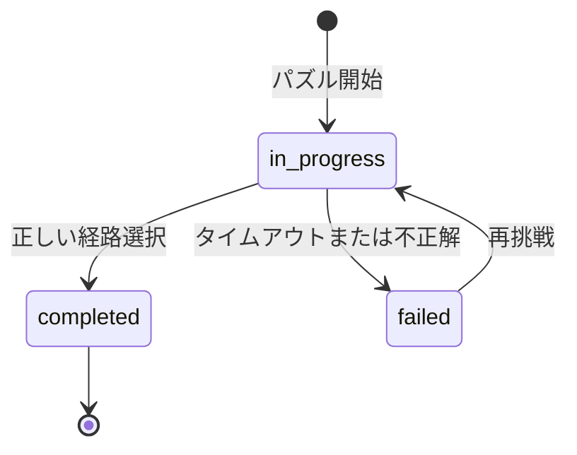

# プロジェクト用語集 (Glossary)

## 概要

このドキュメントは、「首都圏鉄道マスター」プロジェクト内で使用される用語の定義を管理します。

**更新日**: 2026-05-08

## ドメイン用語

プロジェクト固有のビジネス概念や機能に関する用語。

### クエスト (Quest)

**定義**: プレイヤーが挑戦する学習ミッションの単位。クイズ、パズル、チャレンジの3ステップで構成される。

**説明**:
各クエストは特定の路線をテーマにしており、段階的に知識を習得できるように設計されています。クエストをクリアすると新しい路線や車両カード、バッジが報酬として獲得できます。

**関連用語**:
- [クイズ](#クイズ-quiz): クエストの第1ステップ
- [パズル](#パズル-puzzle): クエストの第2ステップ
- [難易度レベル](#難易度レベル-difficulty-level): クエストの難易度分類

**使用例**:
- 「山手線マスターへの道」クエストをクリアする
- レベル1のクエストを3つクリアすると、レベル2がアンロックされる

**データモデル**: `src/types/quest.ts` の `Quest` インターフェース

**英語表記**: Quest

### クエストセッション (Quest Session)

**定義**: クエスト開始時に作成されるプレイセッションの状態オブジェクト。`QuestManager.startQuest()` が返す。

**説明**:
クエストセッションはセッションIDとクエストID、現在のステップインデックス、開始日時、各ステップの結果を保持します。セッションを通じてクエストの進行状況を追跡します。

**主要フィールド**:
- `sessionId`: セッションの一意ID
- `questId`: 対象クエストのID
- `currentStepIndex`: 現在のステップ番号 (0: クイズ、1: パズル、2: チャレンジ)
- `startedAt`: セッション開始日時
- `results`: 各ステップの結果 (`StepResult[]`)

**関連用語**:
- [クエスト](#クエスト-quest): セッションの対象
- [QuestManager](#questmanager): セッションを作成・管理するサービス

**使用例**:
- `startQuest("quest-yamanote-01")` を呼び出してセッションを開始する
- セッションIDを使って `completeStep()` でステップ完了を記録する

**データモデル**: `docs/functional-design.md` の `QuestSession` インターフェース

**英語表記**: Quest Session

### クイズ (Quiz)

**定義**: 鉄道に関する知識を4択形式で問う問題。クエストの第1ステップで出題される。

**説明**:
各クイズ問題には、駅名、路線名、所要時間、乗り換え、会社の特色などのカテゴリがあります。正解すると豆知識が表示され、理解を深められます。

**関連用語**:
- [クエスト](#クエスト-quest): クイズを含むミッション
- [QuizEngine](#quizengine): クイズ採点を行うサービス

**使用例**:
- 「山手線の駅は全部で何駅？」という4択クイズに答える
- クイズに正解すると、「山手線は30駅です」という解説が表示される

**データモデル**: `src/types/quiz.ts` の `QuizQuestion` インターフェース

**英語表記**: Quiz

### パズル (Puzzle)

**定義**: 路線図上で駅を選択して経路を作成するゲーム。クエストの第2ステップで出題される。

**説明**:
出発駅と目的駅が指定され、制約条件(最大駅数、最大乗り換え回数など)を満たす経路を制限時間内に見つけます。正しい経路を選択するとクリアとなり、スコアが計算されます。

**関連用語**:
- [クエスト](#クエスト-quest): パズルを含むミッション
- [PuzzleEngine](#puzzleengine): パズル検証を行うサービス
- [路線図](#路線図-railway-map): パズルで使用する地図データ

**パズルの種類**:
- **経路選択パズル**: 最短経路を見つける
- **乗り換えパズル**: 乗り換え回数を最小にする
- **相互直通パズル**: 乗り換えなしで到達する経路を見つける

**使用例**:
- 「渋谷から品川まで、3駅以内で到着できるかな？」というパズルに挑戦
- 時間制限30秒以内に正しい経路を選択する

**データモデル**: `src/types/puzzle.ts` の `PuzzleData` インターフェース

**英語表記**: Puzzle

### チャレンジ (Challenge)

**定義**: クエストの第3ステップで出題される高難度のミッション。クイズとパズルで学んだ知識を総合的に試す。

**説明**:
チャレンジステップでは、制限時間内に複数の課題をクリアする必要があります。クイズとパズルの複合型や、より複雑な制約条件のパズルが出題されます。クリアすると、特別な報酬やバッジが獲得できます。

**関連用語**:
- [クエスト](#クエスト-quest): チャレンジを含むミッション
- [クイズ](#クイズ-quiz): チャレンジの前提となるステップ
- [パズル](#パズル-puzzle): チャレンジの前提となるステップ

**チャレンジの種類**:
- **タイムアタック**: 制限時間内に複数のパズルをクリア
- **ノーミスチャレンジ**: 一度もミスせずにクイズとパズルをクリア
- **コンボチャレンジ**: クイズ正解後、関連するパズルを連続でクリア

**使用例**:
- 「山手線マスターへの道」の最終チャレンジに挑戦する
- タイムアタックチャレンジで30秒以内に3つのパズルをクリアする

**データモデル**: `src/types/quest.ts` の `ChallengeData` インターフェース

**英語表記**: Challenge

### 難易度レベル (Difficulty Level)

**定義**: クエストの難しさを示す4段階の指標。1(ビギナー)から4(マニア)まで。

**レベル定義**:
- **レベル1 (ビギナー)**: JR中央・総武線各駅停車、東武亀戸線のみ。単純な経路選択。
- **レベル2 (中級者)**: 首都圏主要JR線、主要私鉄が追加。複雑な乗り換え。
- **レベル3 (上級者)**: 相互直通運転を含む複雑な路線。時刻表の読解。
- **レベル4 (マニア)**: 全路線網。レア車両の知識、歴史トリビア。

**関連用語**:
- [クエスト](#クエスト-quest): 難易度レベルを持つ
- [アンロック](#アンロック-unlock): レベルアップで新しいコンテンツがアンロックされる

**使用例**:
- レベル1のクエストを3つクリアすると、レベル2がアンロックされる
- レベル3では相互直通運転のパズルが登場する

**データモデル**: `src/types/quest.ts` の `DifficultyLevel` 型 (1 | 2 | 3 | 4)

**英語表記**: Difficulty Level

### 路線図 (Railway Map)

**定義**: 駅、路線、接続情報を含む鉄道路線のデータ構造。パズルで使用される。

**説明**:
路線図には、各駅の位置、停車する路線、駅間の接続情報(所要時間)が含まれます。プレイヤーはこの路線図を見ながらパズルを解きます。

**構成要素**:
- **駅 (Station)**: 駅ID、駅名、停車する路線、座標
- **路線 (RailwayLine)**: 路線ID、路線名、運営会社、路線カラー
- **接続 (Connection)**: 駅間の接続情報と所要時間

**関連用語**:
- [パズル](#パズル-puzzle): 路線図を使用するゲーム
- [駅](#駅-station): 路線図の構成要素
- [路線](#路線-railway-line): 路線図の構成要素

**使用例**:
- パズル開始時に路線図が表示される
- プレイヤーは路線図上の駅をクリックして経路を選択する

**データモデル**: `src/types/railway.ts` の `RailwayMap` インターフェース

**英語表記**: Railway Map

### 駅 (Station)

**定義**: 鉄道路線上の停車地点。駅名、停車する路線、座標を持つ。

**説明**:
各駅には一意のID(例: `st-shibuya`)が割り当てられ、複数の路線が停車する場合があります。

**関連用語**:
- [路線図](#路線図-railway-map): 駅を含むデータ構造
- [路線](#路線-railway-line): 駅が停車する路線

**使用例**:
- 「渋谷駅」は山手線、埼京線、湘南新宿ライン、東横線など複数の路線が停車する
- パズルで「渋谷駅」を選択して経路に追加する

**データモデル**: `src/types/railway.ts` の `Station` インターフェース

**英語表記**: Station

### 路線 (Railway Line)

**定義**: 鉄道会社が運営する線路のルート。路線名、運営会社、路線カラーを持つ。

**説明**:
各路線には一意のID(例: `line-yamanote`)が割り当てられます。JR線、私鉄、地下鉄の3つのカテゴリに分類されます。

**関連用語**:
- [路線図](#路線図-railway-map): 路線を含むデータ構造
- [駅](#駅-station): 路線が停車する駅

**路線のカテゴリ**:
- **JR線**: 山手線、中央線、総武線など
- **私鉄**: 東急、小田急、京王、西武、東武、京急、京成など
- **地下鉄**: 東京メトロ、都営地下鉄

**使用例**:
- 「山手線」の路線カラーは黄緑色(#9ACD32)
- 「東急東横線」は私鉄カテゴリに分類される

**データモデル**: `src/types/railway.ts` の `RailwayLine` インターフェース

**英語表記**: Railway Line

### プレイヤー進捗 (Player Progress)

**定義**: プレイヤーのゲーム進行状況を記録するデータ。クリア済みクエスト、アンロック済み路線、獲得バッジなどを含む。

**説明**:
プレイヤー進捗はローカルストレージに保存され、ブラウザを閉じても保持されます。データにはプレイヤーID、現在のレベル、統計情報などが含まれます。

**主要データ**:
- クリア済みクエストID
- アンロック済み路線ID
- 獲得したバッジ
- 累計ポイント
- 統計情報(クイズ正解率、パズルクリア率など)

**関連用語**:
- [ProgressManager](#progressmanager): 進捗を管理するサービス
- [デイリーチャレンジ](#デイリーチャレンジ-daily-challenge): 進捗に含まれる日次チャレンジ情報

**使用例**:
- クエストをクリアすると、プレイヤー進捗に記録される
- プレイヤー進捗を確認して、次にプレイすべきクエストを提案する

**データモデル**: `src/types/player.ts` の `PlayerProgress` インターフェース

**英語表記**: Player Progress

### デイリーチャレンジ (Daily Challenge)

**定義**: 毎日異なるクエストに挑戦できる日替わりミッション。クリアするとボーナスポイントが獲得できる。

**説明**:
デイリーチャレンジは毎日午前0時にリセットされ、新しいクエストが提示されます。1日1回までプレイ可能で、クリアするとログインボーナスが付与されます。

**関連用語**:
- [クエスト](#クエスト-quest): デイリーチャレンジで出題されるミッション
- [プレイヤー進捗](#プレイヤー進捗-player-progress): デイリーチャレンジの進捗を記録

**使用例**:
- 今日のデイリーチャレンジは「東急田園都市線マスターへの道」
- デイリーチャレンジをクリアして100ポイントのボーナスを獲得

**データモデル**: `src/types/player.ts` の `DailyChallengeProgress` インターフェース

**英語表記**: Daily Challenge

### バッジ (Badge)

**定義**: 特定の条件を達成すると獲得できる実績の証。コレクション画面で確認できる。

**説明**:
バッジには名前、説明、獲得日時が含まれます。例えば、「山手線マスター」は山手線のクエストを全てクリアすると獲得できます。

**バッジの例**:
- **山手線マスター**: 山手線のクエストを全てクリア
- **乗り換え名人**: 10回以上の乗り換えパズルをクリア
- **全駅制覇**: 全ての駅を含むクエストをクリア

**関連用語**:
- [BadgeSystem](#badgesystem): バッジ獲得条件を判定するサービス
- [プレイヤー進捗](#プレイヤー進捗-player-progress): 獲得したバッジを記録

**使用例**:
- 山手線のクエストを全てクリアして「山手線マスター」バッジを獲得
- コレクション画面で獲得したバッジを確認

**データモデル**: `src/types/player.ts` の `Badge` インターフェース

**英語表記**: Badge

### 車両カード (Vehicle Card)

**定義**: クエストをクリアすることで獲得できるコレクションアイテム。車両の種類とレア度で分類される。

**説明**:
車両カードは「アンロック済み車両ID」としてプレイヤー進捗に記録され、コレクション画面で図鑑として確認できます。レア度が高いほど獲得条件が難しい報酬として設定されます。

**レア度**:
- **common**: 一般的な車両。基本クエストクリアで獲得。
- **rare**: 希少な車両。特定路線クエストや高難度クエストで獲得。
- **legendary**: 伝説の車両。上位クエストや特別条件で獲得。

**関連用語**:
- [報酬](#報酬-reward): 車両カードは報酬の一種
- [アンロック](#アンロック-unlock): クエストクリアで車両カードがアンロックされる
- [バッジ](#バッジ-badge): 同じくクエストで獲得できるコレクションアイテム

**使用例**:
- 「山手線マスターへの道」をクリアして E235系車両カード (rare) を獲得
- コレクション画面で図鑑として収集した車両カードを確認

**データモデル**: `src/types/player.ts` の `unlockedVehicleIds`、`src/types/quest.ts` の `Reward` 型

**英語表記**: Vehicle Card

### 路線写真 (Railway Line Photo)

**定義**: クイズ・フィードバック・路線アンロック演出で表示する、路線を代表する写真。車両・駅・沿線風景などを対象とする。

**説明**:
写真は演出用途のみで使用し、問題のヒントとしては機能しない。各路線に約5枚の写真プール(`quizPhotos`)を用意し、問題ごとにランダム選択する。将来的にフィードバック専用プール(`feedbackPhotos`)も別途用意できる設計になっている。路線アンロック演出では1枚の印象的な写真を表示する。

**ライセンス要件**:
CC0・CC BY・CC BY-SAのみ使用可。CC BY-NCなど非商用限定ライセンスは使用しない。

**関連用語**:
- [帰属表示](#帰属表示-attribution): 写真の下に常時表示する必要があるクレジット情報
- [RailwayLinePhoto](#railwaylinephoto): 写真と帰属表示を担当するUIコンポーネント

**使用例**:
- クイズ「総武線の終点は？」表示時に、総武線の車両写真がランダムに1枚表示される
- 路線アンロック演出で、その路線の代表的な車両・駅写真が大きく表示される

**データモデル**: `src/types/railway.ts` の `RailwayPhoto` インターフェース

**英語表記**: Railway Line Photo

### 帰属表示 (Attribution)

**定義**: 写真などCC系ライセンスのコンテンツを使用する際に、撮影者・ライセンス情報を明示するクレジット表示。

**説明**:
プロジェクトでは写真の下部に常時表示する。CC0は法的表示義務がないが、一貫性のため他ライセンスと同様に表示する。写真の魅力を損なわないよう、写真の外側(下)に小さなグレーテキストで配置する。

**表示フォーマット**:
```
📷 撮影者名 / Wikimedia Commons / CC BY-SA 4.0
```

**関連用語**:
- [路線写真](#路線写真-railway-line-photo): 帰属表示が必要なコンテンツ
- [RailwayLinePhoto](#railwaylinephoto): 帰属表示を含むUIコンポーネント

**英語表記**: Attribution

### アンロック (Unlock)

**定義**: クエストをクリアすることで、新しい路線、車両、レベルが利用可能になること。

**説明**:
プレイヤーは最初はレベル1のクエストのみプレイ可能で、クエストをクリアすると段階的に新しいコンテンツがアンロックされます。

**アンロック対象**:
- **路線**: 新しい路線でのクエストがプレイ可能になる
- **車両カード**: コレクション画面で車両が追加される
- **レベル**: 次の難易度レベルのクエストがプレイ可能になる

**関連用語**:
- [クエスト](#クエスト-quest): クリアでアンロックが発生
- [難易度レベル](#難易度レベル-difficulty-level): レベルアップでアンロック

**使用例**:
- レベル1のクエストを3つクリアすると、レベル2がアンロックされる
- 「山手線マスターへの道」をクリアして、E235系車両カードをアンロック

**英語表記**: Unlock

### 報酬 (Reward)

**定義**: クエストをクリアした際にプレイヤーに付与されるアイテムの共通型。種別とIDで管理される。

**説明**:
報酬は `QuestManager.completeQuest()` が返す配列として処理されます。報酬の種別によって、路線アンロック・車両カード獲得・バッジ付与・ポイント付与のいずれかが行われます。

**報酬の種別**:
| type | 説明 |
|------|------|
| `railway_line` | 新しい路線のアンロック |
| `vehicle_card` | 車両カードの獲得 |
| `badge` | バッジの獲得 |
| `points` | ポイントの付与 |

**主要フィールド**:
- `type`: 報酬種別
- `id`: 報酬ID
- `name`: 報酬名
- `rarity`: レア度 (`common` / `rare` / `legendary`、車両カードとバッジのみ)

**関連用語**:
- [クエスト](#クエスト-quest): 報酬が設定されるエンティティ
- [QuestManager](#questmanager): `completeQuest()` で報酬を返す
- [車両カード](#車両カード-vehicle-card): 報酬種別の一つ
- [バッジ](#バッジ-badge): 報酬種別の一つ

**使用例**:
- クエストクリア時に `completeQuest(sessionId)` が `Reward[]` を返す
- `rewards: [{ type: 'vehicle_card', id: 'e235', name: 'E235系', rarity: 'rare' }]`

**データモデル**: `src/types/quest.ts` の `Reward` インターフェース

**英語表記**: Reward

## 技術用語

プロジェクトで使用している技術・フレームワーク・ツールに関する用語。

### React

**定義**: Meta(旧Facebook)が開発したJavaScriptのUIライブラリ。コンポーネントベースの宣言的なUI構築が特徴。

**公式サイト**: https://react.dev/

**本プロジェクトでの用途**:
全てのUIコンポーネントをReactで実装しています。画面表示、ユーザーインタラクション、状態管理に使用。

**バージョン**: 19.x

**選定理由**:
- コンポーネント設計による再利用性の高さ
- 豊富なエコシステム(ライブラリ、ツール)
- メンテナンス性の向上

**代替技術**:
- Vue.js: 学習曲線は緩やかだが、エコシステムの規模で劣る
- Svelte: パフォーマンスは優れているが、エコシステムが小さい

**関連ドキュメント**:
- [アーキテクチャ設計書](./architecture.md#技術スタック)
- [リポジトリ構造定義書](./repository-structure.md)

**設定ファイル**: `vite.config.ts`

### TypeScript

**定義**: JavaScriptに静的型付けを追加したプログラミング言語。Microsoftが開発。

**公式サイト**: https://www.typescriptlang.org/

**本プロジェクトでの用途**:
全てのソースコードをTypeScriptで記述し、型安全性を確保しています。

**バージョン**: 5.x

**選定理由**:
- 大規模開発での保守性向上
- エディタの補完機能による開発効率向上
- コンパイル時のエラー検出

**代替技術**:
- JavaScript ESM: 型チェックの恩恵が受けられない
- Flow: エコシステムの成熟度でTypeScriptに劣る

**関連ドキュメント**:
- [アーキテクチャ設計書](./architecture.md#技術スタック)
- [開発ガイドライン](./development-guidelines.md)

**設定ファイル**: `tsconfig.json`

### Vite

**定義**: 次世代フロントエンドビルドツール。高速なHMR(Hot Module Replacement)が特徴。

**公式サイト**: https://vitejs.dev/

**本プロジェクトでの用途**:
開発サーバーの起動、本番ビルド、TypeScriptのトランスパイルに使用。

**バージョン**: 8.x

**選定理由**:
- 高速な開発サーバー起動(数秒)
- 最新のビルド設定(ESM、Tree Shaking)
- TypeScriptネイティブサポート

**代替技術**:
- Webpack: 設定が複雑で、起動が遅い
- Parcel: 設定不要だが、カスタマイズ性で劣る

**関連ドキュメント**:
- [アーキテクチャ設計書](./architecture.md#技術スタック)

**設定ファイル**: `vite.config.ts`

### Zustand

**定義**: 軽量なReact状態管理ライブラリ。シンプルなAPIと小さなバンドルサイズが特徴。

**公式サイト**: https://zustand-demo.pmnd.rs/

**本プロジェクトでの用途**:
グローバル状態の管理(クエスト状態、プレイヤー進捗、UI状態)に使用。

**バージョン**: 5.x

**選定理由**:
- シンプルで学習コストが低い
- Redux比で10倍以上軽量(バンドルサイズ)
- TypeScript対応が優れている

**代替技術**:
- Redux: 高機能だが、ボイラープレートが多い
- Context API: グローバル状態には不向き

**関連ドキュメント**:
- [アーキテクチャ設計書](./architecture.md#技術スタック)
- [リポジトリ構造定義書](./repository-structure.md#stores)

**設定ファイル**: なし(コード内で定義)

### Tailwind CSS

**定義**: ユーティリティファーストのCSSフレームワーク。クラス名を組み合わせてスタイリングする。

**公式サイト**: https://tailwindcss.com/

**本プロジェクトでの用途**:
全てのコンポーネントのスタイリングに使用。レスポンシブデザインに対応。

**バージョン**: 4.x

**選定理由**:
- 開発速度の向上(HTMLとCSSを行き来しない)
- 一貫性のあるデザイン
- カスタマイズ性の高さ

**代替技術**:
- CSS Modules: スコープは分離できるが、ユーティリティクラスがない
- Styled Components: CSS-in-JSだが、バンドルサイズが大きい

**関連ドキュメント**:
- [アーキテクチャ設計書](./architecture.md#技術スタック)

**設定ファイル**: なし (v4では`@tailwindcss/vite`プラグイン経由で設定。独立したJavaScript設定ファイル不要)

### Vitest

**定義**: Viteベースの高速テストフレームワーク。Jestと互換性のあるAPI。

**公式サイト**: https://vitest.dev/

**本プロジェクトでの用途**:
ユニットテスト、統合テストの実行とカバレッジ測定に使用。

**バージョン**: 2.x

**選定理由**:
- Viteとの統合で高速起動・実行
- TypeScript/ESMをネイティブサポート
- カバレッジ測定が標準搭載

**代替技術**:
- Jest: 設定が複雑で、ESM対応が不完全
- Mocha: 設定の自由度は高いが、統合が面倒

**関連ドキュメント**:
- [アーキテクチャ設計書](./architecture.md#技術スタック)
- [開発ガイドライン](./development-guidelines.md#テスト戦略)

**設定ファイル**: `vitest.config.ts`

### ESLint

**定義**: JavaScript/TypeScriptの静的解析ツール。コーディング規約の統一とバグの早期発見に使用。

**公式サイト**: https://eslint.org/

**本プロジェクトでの用途**:
コード品質のチェック、コーディング規約の強制に使用。

**バージョン**: 9.x

**選定理由**:
- TypeScript専用ルールセット(@typescript-eslint)
- 潜在的なバグの自動検出
- カスタムルールの定義が可能

**関連ドキュメント**:
- [アーキテクチャ設計書](./architecture.md#技術スタック)
- [開発ガイドライン](./development-guidelines.md#自動化の推進)

**設定ファイル**: `eslint.config.js`

### Prettier

**定義**: コードフォーマッター。コードスタイルを自動整形する。

**公式サイト**: https://prettier.io/

**本プロジェクトでの用途**:
コードフォーマットの自動整形、コードレビュー時の議論削減に使用。

**バージョン**: 3.x

**選定理由**:
- コードスタイルの統一
- レビュー時のフォーマット議論を削減
- ESLintと併用可能

**関連ドキュメント**:
- [アーキテクチャ設計書](./architecture.md#技術スタック)
- [開発ガイドライン](./development-guidelines.md#自動化の推進)

**設定ファイル**: `.prettierrc`

## 略語・頭字語

### MVP

**正式名称**: Minimum Viable Product

**意味**: 最小限の機能を持つ製品。市場に投入して検証するための最小版。

**本プロジェクトでの使用**:
PRDで優先度P0(必須)として定義された機能がMVPに含まれます。

**MVPに含まれる機能**:
- 鉄道クエストモード
- クイズシステム
- 経路選択パズル
- 段階的難易度システム
- デイリーチャレンジ
- 実績バッジ・コレクション

**MVPに含まれない機能** (Post-MVP):
- 週替わりイベント
- ランキングシステム
- 時刻表パズル

### DAU

**正式名称**: Daily Active Users

**意味**: 日次アクティブユーザー数。1日にアプリを利用したユーザーの数。

**本プロジェクトでの使用**:
プライマリーKPIとして設定。目標は500人(6ヶ月後)。

**測定方法**:
ログイン数とゲームプレイ開始数をカウント。

### KPI

**正式名称**: Key Performance Indicator

**意味**: 重要業績評価指標。目標達成度を測定するための指標。

**本プロジェクトでの使用**:
PRDでプライマリーKPIとセカンダリーKPIを定義。

**プライマリーKPI**:
- DAU: 500人(6ヶ月後)
- 平均プレイ時間: 15分以上/セッション
- クエスト完了率: 60%以上

**セカンダリーKPI**:
- 路線アンロック率: 平均5路線以上(3ヶ月後)
- クイズ正解率: 70%以上

### UI

**正式名称**: User Interface

**意味**: ユーザーインターフェース。ユーザーとシステムが相互作用する部分。

**本プロジェクトでの使用**:
Reactコンポーネントで実装されたUIレイヤー。

**UIコンポーネント**:
- 画面コンポーネント(`components/screens/`)
- クイズUI(`components/quiz/`)
- パズルUI(`components/puzzle/`)
- コレクションUI(`components/collection/`)

### PR

**正式名称**: Pull Request

**意味**: プルリクエスト。コードレビューとマージを依頼するGitHubの機能。

**本プロジェクトでの使用**:
全ての変更はPRを通じてレビューされます。

**PRプロセス**:
1. セルフレビュー
2. 自動テスト実行(CI)
3. レビュアーアサイン
4. レビューフィードバック対応
5. 承認後マージ

### CI/CD

**正式名称**: Continuous Integration / Continuous Delivery

**意味**: 継続的インテグレーション/継続的デリバリー。コードの統合とデプロイを自動化する手法。

**本プロジェクトでの使用**:
GitHub Actionsで自動テスト、Lint、ビルドを実行。

**CI/CDパイプライン**:
1. プッシュ時に自動実行
2. Lintチェック
3. 型チェック
4. テスト実行
5. ビルド確認

## アーキテクチャ用語

システム設計・アーキテクチャに関する用語。

### レイヤードアーキテクチャ (Layered Architecture)

**定義**: システムを役割ごとに複数の層に分割し、上位層から下位層への一方向の依存関係を持たせる設計パターン。

**本プロジェクトでの適用**:
3層アーキテクチャを採用しています:

```
UIレイヤー (components/)
    ↓
ゲームロジックレイヤー (services/)
    ↓
データレイヤー (repositories/)
```

**各層の責務**:
- **UIレイヤー**: 画面表示とユーザーインタラクション
- **ゲームロジックレイヤー**: クエスト管理、クイズ採点、パズル検証
- **データレイヤー**: 路線データ、プレイヤーデータの永続化

**メリット**:
- 関心の分離による保守性向上
- テストが容易(各層を独立してテスト可能)
- 変更の影響範囲が限定的

**依存関係のルール**:
- ✅ UIレイヤー → ゲームロジックレイヤー
- ✅ ゲームロジックレイヤー → データレイヤー
- ✅ データレイヤー内(リポジトリ間): 一方向のみ許可
- ❌ データレイヤー → ゲームロジックレイヤー
- ❌ データレイヤー → UIレイヤー
- ❌ データレイヤー内(リポジトリ間): 循環依存禁止

**実装箇所**: `src/` ディレクトリの構造に反映

**参考資料**:
- [アーキテクチャ設計書](./architecture.md)
- [リポジトリ構造定義書](./repository-structure.md)

## サービスクラス

ゲームロジックレイヤーで使用される主要なサービスクラス。

### QuestManager

**定義**: クエストの読み込み、開始、進行、完了を管理するサービスクラス。

**責務**:
- クエストデータの読み込み
- クエストセッションの作成と管理
- ステップ完了の記録
- 報酬の付与

**主要メソッド**:
- `loadQuest(questId: string): Quest`
- `startQuest(questId: string): QuestSession`
- `completeStep(sessionId: string, result: StepResult): void`
- `completeQuest(sessionId: string): Reward[]`

**実装箇所**: `src/services/QuestManager.ts`

**関連用語**:
- [クエスト](#クエスト-quest): 管理対象のエンティティ
- [ゲームロジックレイヤー](#レイヤードアーキテクチャ-layered-architecture): 所属するレイヤー

### QuizEngine

**定義**: クイズの出題と採点を行うサービスクラス。

**責務**:
- クイズ問題の読み込み
- 回答の採点
- 正解/不正解の判定
- 解説の提供

**主要メソッド**:
- `loadQuestions(questStep: QuestStep): QuizQuestion[]`
- `submitAnswer(questionId: string, selectedIndex: number): QuizResult`

**実装箇所**: `src/services/QuizEngine.ts`

**関連用語**:
- [クイズ](#クイズ-quiz): 管理対象のエンティティ
- [ゲームロジックレイヤー](#レイヤードアーキテクチャ-layered-architecture): 所属するレイヤー

### PuzzleEngine

**定義**: パズルの初期化、経路選択の検証、スコア計算を行うサービスクラス。

**責務**:
- パズルの初期化
- 駅選択の検証
- 経路の連続性チェック
- 制約条件のチェック
- スコア計算

**主要メソッド**:
- `initializePuzzle(puzzleData: PuzzleData): PuzzleState`
- `selectStation(puzzleId: string, stationId: string): PathSelection`
- `validatePath(puzzleId: string, selectedPath: string[]): PuzzleResult`

**実装箇所**: `src/services/PuzzleEngine.ts`

**関連用語**:
- [パズル](#パズル-puzzle): 管理対象のエンティティ
- [ゲームロジックレイヤー](#レイヤードアーキテクチャ-layered-architecture): 所属するレイヤー

### ProgressManager

**定義**: プレイヤーの進捗状況を管理するサービスクラス。

**責務**:
- プレイヤー進捗の読み込みと保存
- コンテンツのアンロック
- レベルアップ判定
- バッジの付与

**主要メソッド**:
- `loadProgress(): PlayerProgress`
- `saveProgress(progress: PlayerProgress): void`
- `unlockContent(contentType: string, contentId: string): void`
- `checkLevelUp(): boolean`

**実装箇所**: `src/services/ProgressManager.ts`

**関連用語**:
- [プレイヤー進捗](#プレイヤー進捗-player-progress): 管理対象のエンティティ
- [ゲームロジックレイヤー](#レイヤードアーキテクチャ-layered-architecture): 所属するレイヤー

### BadgeSystem

**定義**: バッジ獲得条件の判定と実績の記録を行うサービスクラス。

**責務**:
- バッジ獲得条件のチェック
- 新規バッジの付与
- 獲得済みバッジの取得

**主要メソッド**:
- `checkBadgeConditions(progress: PlayerProgress): Badge[]`
- `getBadgeById(badgeId: string): BadgeDefinition`
- `getUnlockedBadges(): Badge[]`

**実装箇所**: `src/services/BadgeSystem.ts`

**関連用語**:
- [バッジ](#バッジ-badge): 管理対象のエンティティ
- [ゲームロジックレイヤー](#レイヤードアーキテクチャ-layered-architecture): 所属するレイヤー

### DailyChallengeManager

**定義**: 日付に基づくデイリークエストの提供と完了状態の管理を行うサービスクラス。

**責務**:
- 日付に基づくデイリークエストの提供
- 完了状態の管理
- ボーナスポイントの付与

**主要メソッド**:
- `getDailyQuest(date: string): Quest`
- `isCompleted(date: string): boolean`
- `complete(date: string, bonusPoints: number): DailyChallengeProgress`

**実装箇所**: `src/services/DailyChallengeManager.ts`

**関連用語**:
- [デイリーチャレンジ](#デイリーチャレンジ-daily-challenge): 管理対象のエンティティ
- [ゲームロジックレイヤー](#レイヤードアーキテクチャ-layered-architecture): 所属するレイヤー

## UIコンポーネント

UIレイヤーで使用される主要なReactコンポーネント。

### RailwayLinePhoto

**定義**: 路線写真と帰属表示を一体で表示するReactコンポーネント。

**責務**:
- `RailwayPhoto` オブジェクトを受け取り、写真と帰属テキストを表示する
- 帰属テキストは写真の下にグレーの小テキストで常時表示する

**実装箇所**: `src/components/common/RailwayLinePhoto.tsx`

**関連用語**:
- [路線写真](#路線写真-railway-line-photo): 表示対象のデータ
- [帰属表示](#帰属表示-attribution): 必須で表示するクレジット情報

## リポジトリクラス

データレイヤーで使用される主要なリポジトリクラス。データの永続化・取得・キャッシュ管理を担当し、ビジネスロジックは実装しない。

### RailwayDataRepository

**定義**: 路線データの読み込みと駅・路線情報の提供を担当するリポジトリクラス。

**責務**:
- 路線データの読み込み
- 駅・路線情報の提供
- 経路探索

**主要メソッド**:
- `loadRailwayMap(): RailwayMap`
- `getStationById(stationId: string): Station`
- `getLineById(lineId: string): RailwayLine`
- `findPath(fromStationId: string, toStationId: string, constraints?: PathConstraints): Path[]`

**実装箇所**: `src/repositories/RailwayDataRepository.ts`

**関連用語**:
- [路線図](#路線図-railway-map): 返却するデータ型
- [データレイヤー](#レイヤードアーキテクチャ-layered-architecture): 所属するレイヤー

### PlayerDataRepository

**定義**: プレイヤーデータのローカルストレージへの保存と読み込みを担当するリポジトリクラス。

**責務**:
- ローカルストレージへのプレイヤー進捗の保存
- プレイヤー進捗の読み込み
- データの存在確認とリセット

**主要メソッド**:
- `save(progress: PlayerProgress): void`
- `load(): PlayerProgress | null`
- `exists(): boolean`
- `reset(): void`

**実装箇所**: `src/repositories/PlayerDataRepository.ts`

**関連用語**:
- [プレイヤー進捗](#プレイヤー進捗-player-progress): 保存・読み込み対象のデータ型
- [データレイヤー](#レイヤードアーキテクチャ-layered-architecture): 所属するレイヤー

## ステータス・状態

システム内で使用される各種ステータスの定義。

### クエストステータス (Quest Status)

**定義**: クエストセッションの進行状態を示す列挙型。

**取りうる値**:

| ステータス | 意味 | 遷移条件 | 次の状態 |
|----------|------|---------|---------|
| `in_progress` | 進行中 | クエスト開始時の初期状態 | `completed`, `failed` |
| `completed` | 完了 | 全てのステップをクリア | - |
| `failed` | 失敗 | ステップで失敗 | `in_progress` (再挑戦) |

**状態遷移図**:


**実装**:
```typescript
type QuestStatus = 'in_progress' | 'completed' | 'failed';
```

**実装箇所**: `src/types/quest.ts`

### クイズステータス (Quiz Status)

**定義**: クイズ回答セッションの状態を示す列挙型。

**取りうる値**:

| ステータス | 意味 | 遷移条件 | 次の状態 |
|----------|------|---------|---------|
| `answering` | 回答中 | クイズ表示時の初期状態 | `correct`, `incorrect` |
| `correct` | 正解 | 正しい選択肢を回答 | - |
| `incorrect` | 不正解 | 誤った選択肢を回答 | - |

**状態遷移図**:


**実装**:
```typescript
type QuizStatus = 'answering' | 'correct' | 'incorrect';
```

**実装箇所**: `src/types/quiz.ts`

### パズルステータス (Puzzle Status)

**定義**: パズルセッションの状態を示す列挙型。

**取りうる値**:

| ステータス | 意味 | 遷移条件 | 次の状態 |
|----------|------|---------|---------|
| `in_progress` | プレイ中 | パズル開始時の初期状態 | `completed`, `failed` |
| `completed` | 成功 | 正しい経路を選択 | - |
| `failed` | 失敗 | 制限時間切れまたは不正解 | `in_progress` (再挑戦) |

**状態遷移図**:


**実装**:
```typescript
type PuzzleStatus = 'in_progress' | 'completed' | 'failed';
```

**実装箇所**: `src/types/puzzle.ts`

## エラー・例外

システムで定義されているエラーと例外。

### ValidationError

**クラス名**: `ValidationError`

**継承元**: `Error`

**発生条件**:
ユーザー入力またはデータが検証ルールに違反した場合に発生します。

**エラーメッセージフォーマット**:
```
[フィールド名]: [エラー内容]
```

**対処方法**:
- **ユーザー**: エラーメッセージに従って入力を修正
- **開発者**: バリデーションロジックが正しいか確認

**ログレベル**: WARN (ユーザー起因のエラーのため)

**実装箇所**: `src/utils/validation.ts`

**使用例**:
```typescript
// エラーのスロー
if (selectedIndex < 0 || selectedIndex > 3) {
  throw new ValidationError(
    'クイズの選択肢は0-3の範囲で指定してください',
    'selectedIndex',
    selectedIndex
  );
}

// エラーのハンドリング
try {
  await quizEngine.submitAnswer(questionId, selectedIndex);
} catch (error) {
  if (error instanceof ValidationError) {
    console.error(`入力エラー: ${error.message}`);
  }
}
```

### NotFoundError

**クラス名**: `NotFoundError`

**継承元**: `Error`

**発生条件**:
指定されたリソース(クエスト、クイズ、パズルなど)が見つからない場合に発生します。

**エラーメッセージフォーマット**:
```
[リソース種別] not found: [ID]
```

**対処方法**:
- **ユーザー**: 存在するリソースを指定
- **開発者**: IDの妥当性を確認

**ログレベル**: ERROR

**実装箇所**: `src/utils/errors.ts`

**使用例**:
```typescript
// エラーのスロー
const quest = await questRepository.findById(questId);
if (!quest) {
  throw new NotFoundError('Quest', questId);
}

// エラーのハンドリング
try {
  const quest = await questManager.loadQuest(questId);
} catch (error) {
  if (error instanceof NotFoundError) {
    console.error(`クエストが見つかりません: ${error.id}`);
  }
}
```

### StorageError

**クラス名**: `StorageError`

**継承元**: `Error`

**発生条件**:
ローカルストレージへの読み書きに失敗した場合に発生します。

**エラーメッセージフォーマット**:
```
[エラー内容]
```

**対処方法**:
- **ユーザー**: ブラウザの設定を確認、ローカルストレージの容量を確認
- **開発者**: データのサイズを確認、バックアップから復元

**ログレベル**: ERROR

**実装箇所**: `src/repositories/PlayerDataRepository.ts`

**使用例**:
```typescript
// エラーのスロー
try {
  localStorage.setItem(this.STORAGE_KEY, JSON.stringify(progress));
} catch (error) {
  throw new StorageError('データの保存に失敗しました', error as Error);
}

// エラーのハンドリング
try {
  await progressManager.saveProgress(progress);
} catch (error) {
  if (error instanceof StorageError) {
    console.error('保存に失敗しました。ブラウザの設定を確認してください。');
  }
}
```

### NetworkError

**クラス名**: `NetworkError`

**継承元**: `Error`

**発生条件**:
HTTPリクエストが失敗した場合（ネットワーク切断、非200レスポンスなど）に発生します。

**エラーメッセージフォーマット**:
```
HTTPエラー: [ステータスコード] [ステータステキスト]
```

**対処方法**:
- **ユーザー**: ネットワーク接続を確認
- **開発者**: `statusCode` プロパティでHTTPステータスを確認

**ログレベル**: ERROR

**実装箇所**: `src/utils/errors.ts`

**使用例**:
```typescript
// エラーのスロー
if (!response.ok) {
  throw new NetworkError(
    `HTTPエラー: ${response.status} ${response.statusText}`,
    response.status
  );
}

// エラーのハンドリング
try {
  const data = await robustFetch(url);
} catch (error) {
  if (error instanceof NetworkError) {
    console.error(`ネットワークエラー: ${error.message}, ステータス: ${error.statusCode}`);
  }
}
```

## 索引

### あ行
- [アーキテクチャ用語](#アーキテクチャ用語) - セクション
- [アンロック](#アンロック-unlock) - ドメイン用語

### え行
- [駅](#駅-station) - ドメイン用語

### か行
- [クエスト](#クエスト-quest) - ドメイン用語
- [クエストセッション](#クエストセッション-quest-session) - ドメイン用語
- [クエストステータス](#クエストステータス-quest-status) - ステータス
- [クイズ](#クイズ-quiz) - ドメイン用語
- [クイズステータス](#クイズステータス-quiz-status) - ステータス
- [車両カード](#車両カード-vehicle-card) - ドメイン用語

### さ行
- [サービスクラス](#サービスクラス) - セクション
- [ステータス・状態](#ステータス状態) - セクション

### た行
- [チャレンジ](#チャレンジ-challenge) - ドメイン用語
- [デイリーチャレンジ](#デイリーチャレンジ-daily-challenge) - ドメイン用語
- [ドメイン用語](#ドメイン用語) - セクション

### な行
- [難易度レベル](#難易度レベル-difficulty-level) - ドメイン用語

### は行
- [バッジ](#バッジ-badge) - ドメイン用語
- [パズル](#パズル-puzzle) - ドメイン用語
- [パズルステータス](#パズルステータス-puzzle-status) - ステータス
- [プレイヤー進捗](#プレイヤー進捗-player-progress) - ドメイン用語
- [報酬](#報酬-reward) - ドメイン用語

### ら行
- [略語・頭字語](#略語頭字語) - セクション
- [リポジトリクラス](#リポジトリクラス) - セクション
- [路線](#路線-railway-line) - ドメイン用語
- [路線図](#路線図-railway-map) - ドメイン用語
- [路線写真](#路線写真-railway-line-photo) - ドメイン用語
- [レイヤードアーキテクチャ](#レイヤードアーキテクチャ-layered-architecture) - アーキテクチャ用語

### A-Z
- [Attribution (帰属表示)](#帰属表示-attribution) - ドメイン用語
- [BadgeSystem](#badgesystem) - サービスクラス
- [CI/CD](#cicd) - 略語
- [DailyChallengeManager](#dailychallengemanager) - サービスクラス
- [DAU](#dau) - 略語
- [ESLint](#eslint) - 技術用語
- [KPI](#kpi) - 略語
- [MVP](#mvp) - 略語
- [NetworkError](#networkerror) - エラー
- [NotFoundError](#notfounderror) - エラー
- [PlayerDataRepository](#playerdatarepository) - リポジトリクラス
- [Prettier](#prettier) - 技術用語
- [PR](#pr) - 略語
- [ProgressManager](#progressmanager) - サービスクラス
- [PuzzleEngine](#puzzleengine) - サービスクラス
- [QuestManager](#questmanager) - サービスクラス
- [QuestSession (クエストセッション)](#クエストセッション-quest-session) - ドメイン用語
- [QuizEngine](#quizengine) - サービスクラス
- [RailwayDataRepository](#railwaydatarepository) - リポジトリクラス
- [RailwayLinePhoto](#railwaylinephoto) - UIコンポーネント
- [React](#react) - 技術用語
- [Reward (報酬)](#報酬-reward) - ドメイン用語
- [StorageError](#storageerror) - エラー
- [Tailwind CSS](#tailwind-css) - 技術用語
- [TypeScript](#typescript) - 技術用語
- [UI](#ui) - 略語
- [ValidationError](#validationerror) - エラー
- [VehicleCard (車両カード)](#車両カード-vehicle-card) - ドメイン用語
- [Vite](#vite) - 技術用語
- [Vitest](#vitest) - 技術用語
- [Zustand](#zustand) - 技術用語
